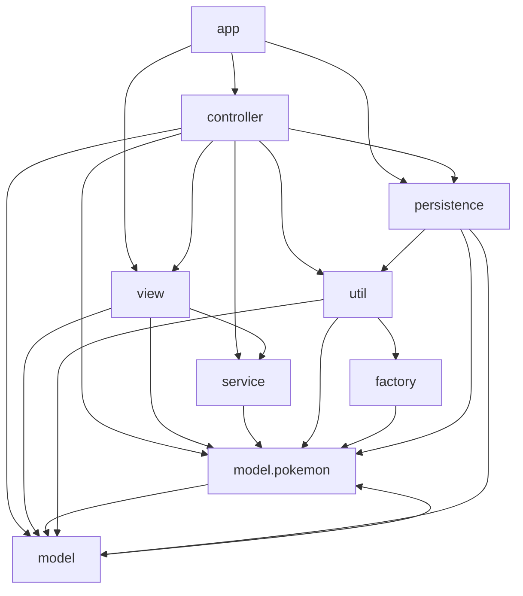
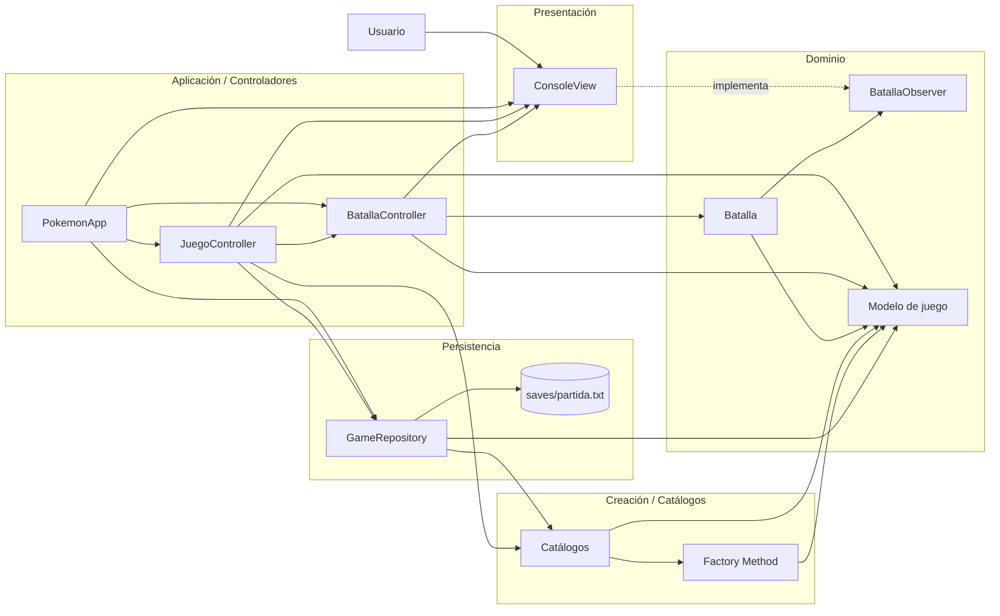
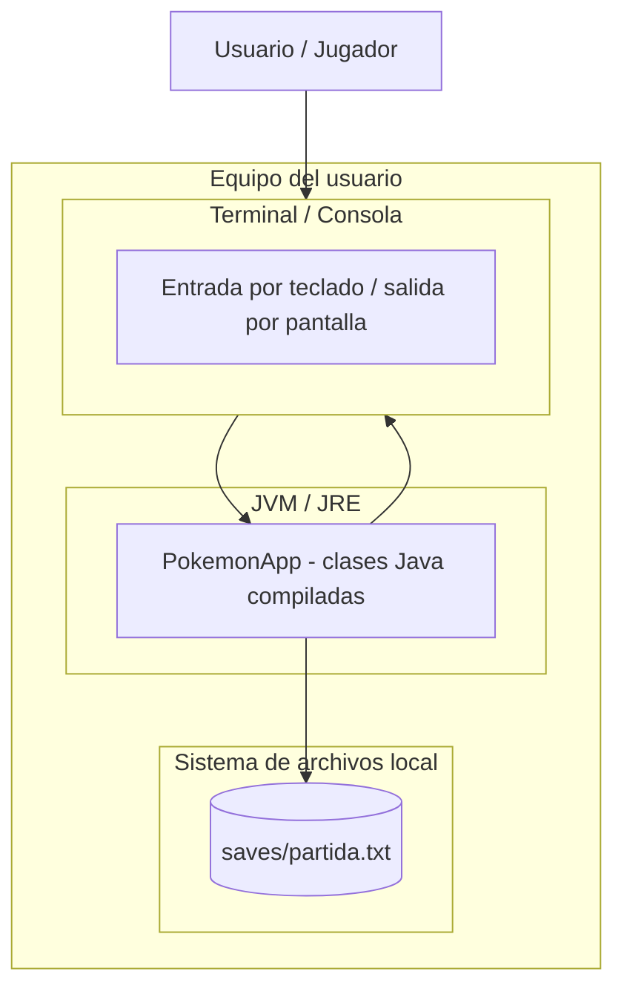

# PokemonApp

Aplicación de consola desarrollada en Java que simula una aventura básica de Pokémon.  
El jugador puede crear una nueva partida, elegir un Pokémon inicial, explorar para iniciar batallas, usar objetos, revisar su equipo, guardar la partida y continuar desde un archivo local.

## Tabla de contenido

- [Descripción](#descripción)
- [Características principales](#características-principales)
- [Tecnologías utilizadas](#tecnologías-utilizadas)
- [Requisitos](#requisitos)
- [Estructura del proyecto](#estructura-del-proyecto)
- [Instalación y ejecución](#instalación-y-ejecución)
- [Funcionamiento general](#funcionamiento-general)
- [Arquitectura del proyecto](#arquitectura-del-proyecto)
- [Diagramas](#diagramas)
- [Persistencia](#persistencia)
- [Patrones de diseño usados](#patrones-de-diseño-usados)

## Descripción

`PokemonApp` es un juego por consola inspirado en Pokémon. El proyecto está organizado por capas y paquetes, separando la lógica de presentación, controladores, dominio, servicios, fábricas, utilidades y persistencia.

El flujo principal permite al usuario:

1. Crear una nueva partida.
2. Elegir un Pokémon inicial.
3. Explorar para iniciar batallas contra rivales.
4. Atacar, usar objetos, cambiar Pokémon o rendirse durante una batalla.
5. Ganar dinero y experiencia.
6. Evolucionar Pokémon al alcanzar cierto nivel.
7. Guardar y cargar la partida desde un archivo local.

## Características principales

- Juego interactivo por consola.
- Menú principal con opciones de exploración, equipo, inventario, uso de objetos, guardado y salida.
- Sistema de batalla por turnos.
- Selección de movimientos por Pokémon.
- Cálculo de daño con ataque, defensa y efectividad de tipos.
- Sistema de experiencia y subida de nivel.
- Evolución de Pokémon a partir del nivel 16.
- Inventario con objetos consumibles.
- Guardado y carga de partida mediante archivo local.
- Uso de catálogos para crear Pokémon, objetos y rivales.
- Implementación de patrones como MVC, Observer y Factory Method.

## Tecnologías utilizadas

- Java
- Programación orientada a objetos
- Aplicación de consola
- Persistencia en archivo `.txt`
- IntelliJ IDEA como entorno sugerido

## Requisitos

Para ejecutar el proyecto se recomienda tener instalado:

- Java JDK 21 o superior
- IntelliJ IDEA, VS Code o cualquier editor compatible con Java

> Nota: el proyecto utiliza características modernas de Java como `record`, expresiones `switch`, `Stream.toList()` y `List.getFirst()`, por lo que se recomienda usar Java 21.

## Estructura del proyecto

```text
PokemonApp/
│
├── src/
│   ├── app/
│   │   ├── Main.java
│   │   └── PokemonApp.java
│   │
│   ├── controller/
│   │   ├── JuegoController.java
│   │   └── BatallaController.java
│   │
│   ├── factory/
│   │   ├── CreadorMovimiento.java
│   │   ├── CreadorMovimientoAgua.java
│   │   ├── CreadorMovimientoAire.java
│   │   ├── CreadorMovimientoElectrico.java
│   │   ├── CreadorMovimientoFuego.java
│   │   ├── CreadorMovimientoPsiquico.java
│   │   └── CreadorMovimientoTierra.java
│   │
│   ├── model/
│   │   ├── Inventario.java
│   │   ├── Objeto.java
│   │   └── pokemon/
│   │       ├── Entrenador.java
│   │       ├── Pokemon.java
│   │       ├── Movimiento.java
│   │       ├── MovimientoAgua.java
│   │       ├── MovimientoAire.java
│   │       ├── MovimientoElectrico.java
│   │       ├── MovimientoFuego.java
│   │       ├── MovimientoPsiquico.java
│   │       ├── MovimientoTierra.java
│   │       ├── TipoPokemon.java
│   │       ├── EstadoPokemon.java
│   │       └── EstadoBatalla.java
│   │
│   ├── persistence/
│   │   └── GameRepository.java
│   │
│   ├── service/
│   │   ├── Batalla.java
│   │   └── BatallaObserver.java
│   │
│   ├── util/
│   │   ├── PokemonCatalogo.java
│   │   ├── ObjetoCatalogo.java
│   │   └── EntrenadorCatalogo.java
│   │
│   └── view/
│       └── ConsoleView.java
│
├── saves/
│   └── partida.txt
│
├── diagramas/
│   └── diagrama de clases final proyecto pokemon.svg
│
├── PokemonApp.iml
└── README.md
```

## Instalación y ejecución

### Opción 1: Ejecutar desde IntelliJ IDEA

1. Abrir IntelliJ IDEA.
2. Seleccionar **Open**.
3. Abrir la carpeta del proyecto `PokemonApp`.
4. Verificar que el SDK configurado sea Java 21 o superior.
5. Abrir el archivo:

```text
src/app/Main.java
```

6. Ejecutar el método `main`.

### Opción 2: Ejecutar desde terminal

Desde la raíz del proyecto:

```bash
mkdir -p out
javac -d out $(find src -name "*.java")
java -cp out app.Main
```

En Windows PowerShell:

```powershell
mkdir out
Get-ChildItem -Recurse -Filter *.java src | ForEach-Object { $_.FullName } > sources.txt
javac -d out @sources.txt
java -cp out app.Main
```

## Funcionamiento general

Al iniciar la aplicación, el sistema muestra un menú inicial.

Si existe una partida guardada en `saves/partida.txt`, el jugador puede continuarla o crear una nueva.

Si no existe partida guardada, se inicia una nueva aventura.

Durante una nueva partida:

1. Se solicita el nombre del entrenador.
2. Se crea un entrenador con dinero inicial.
3. Se asigna un inventario inicial.
4. El jugador elige un Pokémon inicial.
5. Se entra al menú principal del juego.

Opciones principales del juego:

```text
1. Explorar (nueva batalla)
2. Ver equipo
3. Inventario
4. Usar objeto
5. Guardar partida
6. Salir
```

Durante una batalla, el jugador puede:

```text
1. Atacar
2. Usar objeto
3. Cambiar Pokémon
4. Rendirse
```

## Arquitectura del proyecto

El proyecto sigue una arquitectura por capas:

| Capa | Paquete | Responsabilidad |
|---|---|---|
| Entrada de aplicación | `app` | Inicializa la aplicación |
| Controladores | `controller` | Coordina el flujo del juego y las batallas |
| Vista | `view` | Gestiona la entrada y salida por consola |
| Servicio | `service` | Contiene la lógica principal de batalla |
| Modelo | `model`, `model.pokemon` | Representa entidades del dominio |
| Fábricas | `factory` | Crea movimientos mediante Factory Method |
| Utilidades | `util` | Contiene catálogos de Pokémon, objetos y rivales |
| Persistencia | `persistence` | Guarda y carga partidas desde archivo |

## Diagramas

### Diagrama de paquetes



### Diagrama de componentes



### Diagrama de despliegue



## Persistencia

La persistencia se realiza mediante la clase:

```text
persistence/GameRepository.java
```

El archivo de guardado se almacena en:

```text
saves/partida.txt
```

La información guardada incluye:

- Datos del entrenador.
- Pokémon del equipo activo.
- Pokémon almacenados.
- Inventario del jugador.

Ejemplo aproximado del formato de guardado:

```text
ENTRENADOR,1,Ash,1000.0
EQUIPO,1,Charmander,FUEGO,5,100,100,52,43,65,ACTIVO,11
INVENTARIO,1,2,3,4
```

## Modelo principal

### Entrenador

Representa al jugador o a un rival.

Contiene:

- ID
- Nombre
- Dinero
- Equipo activo
- Almacenamiento
- Inventario

### Pokémon

Representa una criatura del juego.

Contiene:

- ID
- Nombre
- Tipo
- Nivel
- Experiencia
- Vida actual
- Vida máxima
- Ataque
- Defensa
- Velocidad
- Estado
- Movimientos
- Evolución

### Movimiento

Interfaz base para los movimientos.

Implementaciones existentes:

- `MovimientoAgua`
- `MovimientoAire`
- `MovimientoElectrico`
- `MovimientoFuego`
- `MovimientoPsiquico`
- `MovimientoTierra`

### Objeto

Representa objetos del inventario.

Tipos disponibles:

- `POCION`
- `SUPER_POCION`
- `REVIVIR`
- `POKEBOLA`

## Pokémon disponibles

Pokémon base incluidos en el catálogo:

| ID | Pokémon | Tipo |
|---:|---|---|
| 1 | Charmander | Fuego |
| 2 | Squirtle | Agua |
| 3 | Geodude | Tierra |
| 4 | Pikachu | Eléctrico |
| 5 | Abra | Psíquico |
| 6 | Pidgey | Aire |

Evoluciones disponibles:

| ID | Evolución | Tipo |
|---:|---|---|
| 11 | Charmeleon | Fuego |
| 12 | Wartortle | Agua |
| 13 | Graveler | Tierra |
| 14 | Raichu | Eléctrico |
| 15 | Kadabra | Psíquico |
| 16 | Pidgeotto | Aire |

## Rivales disponibles

| Rival | Equipo |
|---|---|
| Gary | Squirtle |
| Misty | Abra |
| Brock | Geodude, Pikachu |

También existe una opción de rival escalado según el nivel promedio del jugador.

## Objetos disponibles

| ID | Objeto | Efecto | Valor |
|---:|---|---|---:|
| 1 | Poción | Restaura 20 HP | 200 |
| 2 | Super Poción | Restaura 50 HP | 500 |
| 3 | Revivir | Revive un Pokémon debilitado | 1500 |
| 4 | Pokébola | Objeto pensado para captura | 200 |

## Sistema de batalla

La batalla se gestiona principalmente mediante la clase:

```text
service/Batalla.java
```

El sistema contempla:

- Turnos entre dos entrenadores.
- Selección automática del primer turno según velocidad.
- Validación de movimientos disponibles.
- Cálculo de daño.
- Efectividad por tipo.
- Notificación de eventos mediante observadores.
- Finalización de batalla cuando un equipo queda sin Pokémon disponibles.
- Recompensa de dinero para el ganador.

El daño se calcula usando:

```text
daño final = daño base * modificador de ataque/defensa * efectividad
```

## Efectividad de tipos

El enum `TipoPokemon` define relaciones básicas de efectividad:

- Fuego es fuerte contra Tierra.
- Fuego es débil contra Agua.
- Agua es fuerte contra Fuego.
- Agua es débil contra Tierra.
- Tierra es fuerte contra Eléctrico.
- Tierra es débil contra Fuego.
- Aire es fuerte contra Tierra.
- Aire es débil contra Eléctrico.
- Eléctrico es fuerte contra Agua.
- Eléctrico no afecta a Tierra.
- Psíquico tiene efectividad neutral.

## Patrones de diseño usados

### MVC

El proyecto separa responsabilidades entre:

- Modelo: `model`, `model.pokemon`
- Vista: `view.ConsoleView`
- Controlador: `controller.JuegoController`, `controller.BatallaController`

### Observer

La clase `Batalla` notifica eventos a través de la interfaz `BatallaObserver`.

La vista `ConsoleView` implementa esta interfaz para mostrar eventos como:

- Inicio de batalla.
- Inicio de turno.
- Movimiento usado.
- Pokémon debilitado.
- Fin de batalla.

### Factory Method

El paquete `factory` contiene creadores de movimientos:

- `CreadorMovimientoAgua`
- `CreadorMovimientoAire`
- `CreadorMovimientoElectrico`
- `CreadorMovimientoFuego`
- `CreadorMovimientoPsiquico`
- `CreadorMovimientoTierra`

Estos permiten crear movimientos concretos sin acoplar directamente el catálogo a las clases específicas.

### Repository

La clase `GameRepository` centraliza la lógica de guardado y carga de partidas.

## Autor

Valentina Paz y Santiago Vivas

## Licencia

Este proyecto puede utilizarse con fines académicos y de aprendizaje.